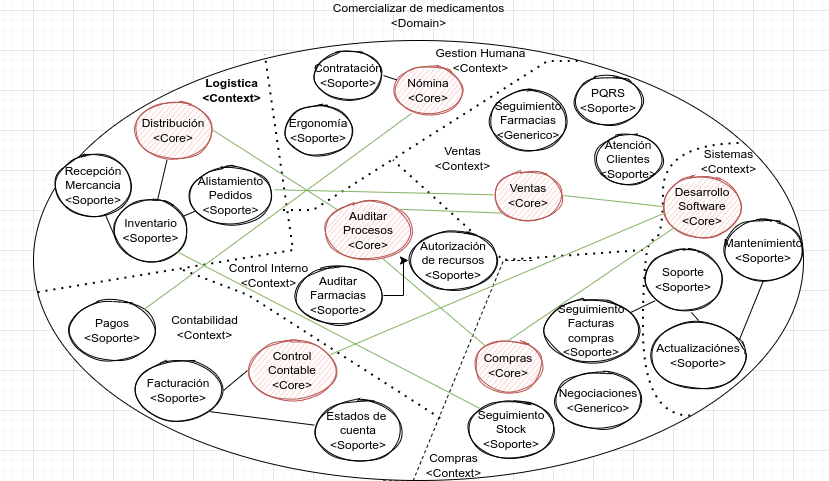

# actividadDDD

#### Equipo integrado por:
#### Steveen Rodriguez
#### Jeyson Pereira
#### Maricela Coral

#### 1- Contextualización:
##### Se realizó la implementación de DDD (Domain Driven Design) en un empresa comercializadora de medicamentos.
####  2- Análisis del problema:
#### En nuestro modelo de dominio tenenemos los siguientes contextos:
#### Core domain:  Logística y distribución
#### El modelo completo se encuentra en el siguiete link: https://app.diagrams.net/#G13MFWA5EimY-Y9YIBLcw0XUAlw-B72hVZ

#### En el modelo de dominio tenemos los siguientes agregados:

#### Pedido
#### Factura
#### Transporte
#### Consideraciones importantes:
#### 1. Un pedido contiene una lista de medicamentos
#### 2. Una factura puede tener varios pedidos para un mismos clientes

